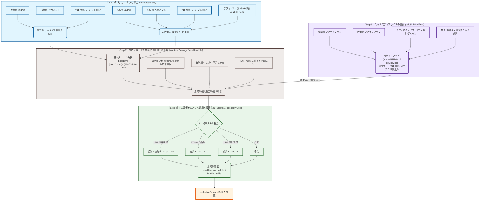

# WoS Battle Simulator 計算プロセスフロー図 (calculation_flow.md)

本ドキュメントは、ホワイトアウト・サバイバル (WoS) 戦闘シミュレーターにおけるダメージ・撃破数計算プロセス（[battleSimulator.js](./src/utils/battleSimulator.js) 内の実装）を Mermaid.js を用いて視覚化したものです。

---

## 計算プロセスフロー (4つのステップ)

GitHub上で本ファイルを表示すると、以下のMermaid記法に基づいたフローダイアグラムが自動的にレンダリングされて描画されます。

---

## 開発上の同期ルール (重要)

プロジェクト全体の開発規約として、以下が定められています。

> [!IMPORTANT]
> **ロジック変更時の同期ルール**
> 今後シミュレーターの戦闘計算ロジック（`src/utils/battleSimulator.js`）を変更・修正した際は、必ず以下のドキュメント類も合わせて同様に修正・更新し、同期させてください。
> 1.  [calculation_logic_summary.txt](./calculation_logic_summary.txt) : テキスト版仕様書
> 2.  [calculation_flow.md](./calculation_flow.md) : 本フロー図 (Mermaid)
