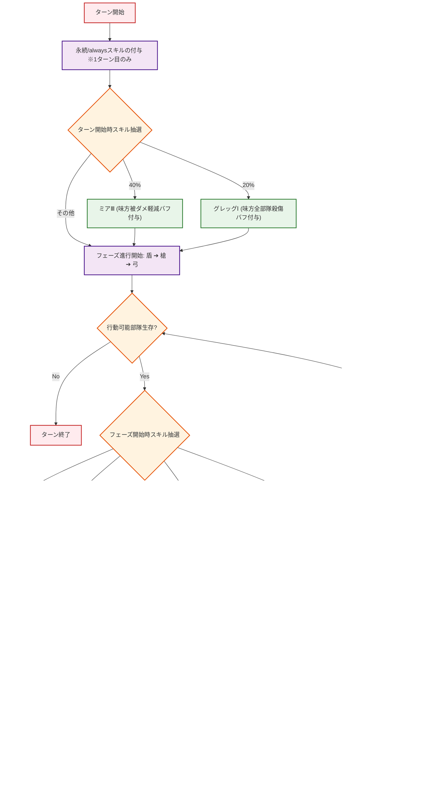
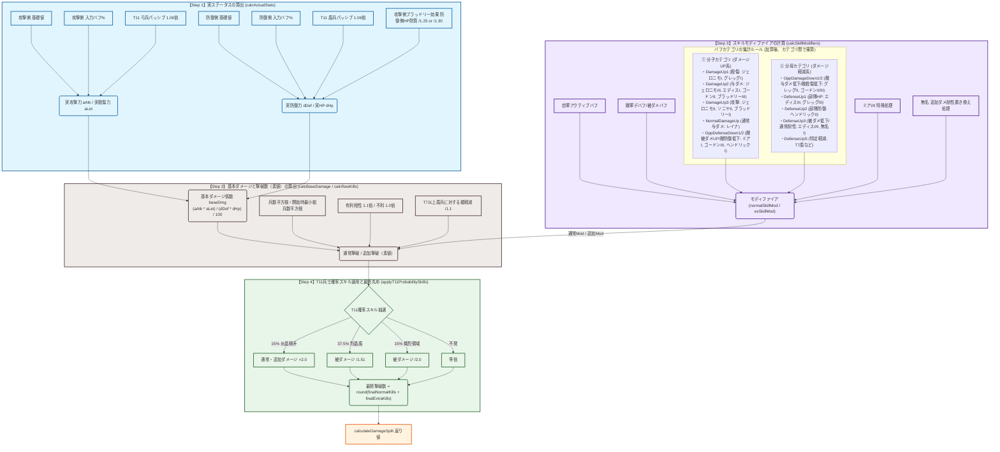

# WoS Battle Simulator 計算プロセスフロー図 (calculation_flow.md)

本ドキュメントは、ホワイトアウト・サバイバル (WoS) 戦闘シミュレーターにおけるターン進行およびダメージ・撃破数計算プロセス（[battleSimulator.js](./src/utils/battleSimulator.js) およびそこから切り出された英雄スキル特殊処理モジュール [heroSkills.js](./src/utils/heroSkills.js) 内の実装）を Mermaid.js を用いて視覚化したものである。

---

## 1. ターン進行とスキル抽選フロー (processOneTurn)

シミュレーターが1ターンをどのように実行し、各英雄の確率スキルや効果がいつ抽選・適用されるかを示す。

---

## 1.5. processOneTurn と calculateDamageSplit の関係性とスキル判定タイミング

両関数は「全体進行」と「個別計算」という役割分担をしており、英雄・兵士のスキルもその処理の階層に応じて適切なタイミングで評価される。

### 💡 「ターン」と「フェーズ」の違い

* **ターン (Turn)**: 戦闘の全体的な進行単位（最大1000ターン）。1つのターン内に、生存している兵種ごとの「フェーズ」が最大3つ含まれる。ターン開始時に評価されるスキル（ミアⅢ、グレッグⅠ、周期系バフなど）はここで判定される。

* **フェーズ (Phase)**: 1ターン内における各兵種（優先度順: 盾 ➔ 槍 ➔ 弓）の個別行動ステップ。同じフェーズ内で、味方と敵の同一兵種がそれぞれ攻撃を行う（例: 「盾兵フェーズ」では味方盾兵と敵盾兵が同時に相手部隊を攻撃し、その後「槍兵フェーズ」へ進む）。フェーズ開始時に評価されるスキル（ミアⅠ、グレッグⅡデバフ、T11槍奇襲など）はこのタイミングで判定される。

| 階層 / 処理単位 | 担当関数 | 主な処理内容 | 評価される主なスキル・効果 |
| :--- | :--- | :--- | :--- |
| **① ターン全体** | `processOneTurn` (前半) | ターンの開始、周期効果の適用、全体バフの抽選 | ・**ミアⅢ** (40%味方被ダメ軽減) ・**グレッグⅠ** (20%味方殺傷バフ) ・3n/4n/5n 周期系バフ |
| **② フェーズ単位** (優先度: 盾➔槍➔弓) | `processOneTurn` (中盤) | 生存判定、行動順の制御、奇襲判定、フェーズデバフの抽選 | ・**ミアⅠ** (50%敵被ダメ増加デバフ) ・**グレッグⅡ / ゴードンⅡ** (20%敵殺傷低下デバフ) ・**T11槍奇襲** (20%ターゲット固定) |
| **③ 攻撃・計算単位** (各攻撃アクション) | `calculateDamageSplit` (内部) | 実ステータス算出、攻撃時の即時追加ダメージや兵士確率スキルの判定 | ・**ミアⅡ** (50%攻撃時追加ダメ) ・**ゴードンⅠ** (槍偶数回攻撃追加ダメ) ・**ソニヤⅢ** (5T毎追加ダメ&スタン) ・**T11弓兵確率スキル** (連射/燃晶火薬) ・**T11確率防御スキル** (烈晶盾/熾烈領域) |

---

## 2. ダメージ計算プロセス (calculateDamageSplit)

1回の攻撃フェーズで実行される詳細なダメージおよび撃破数の計算ロジック（4つのステップ）である。

---

## 開発上の同期ルール (重要)

プロジェクト全体の開発規約として、以下が定められている。

> [!IMPORTANT]
> **ロジック変更時の同期ルール**
> 今後シミュレーターの戦闘計算ロジック（`src/utils/battleSimulator.js`）を変更・修正した際は、必ず以下のドキュメント類も合わせて同様に修正・更新し、同期させること。
> 1.  [calculation_logic_summary.md](./calculation_logic_summary.md) : 仕様書
> 2.  [calculation_flow.md](./calculation_flow.md) : 本フロー図 (Mermaid)
